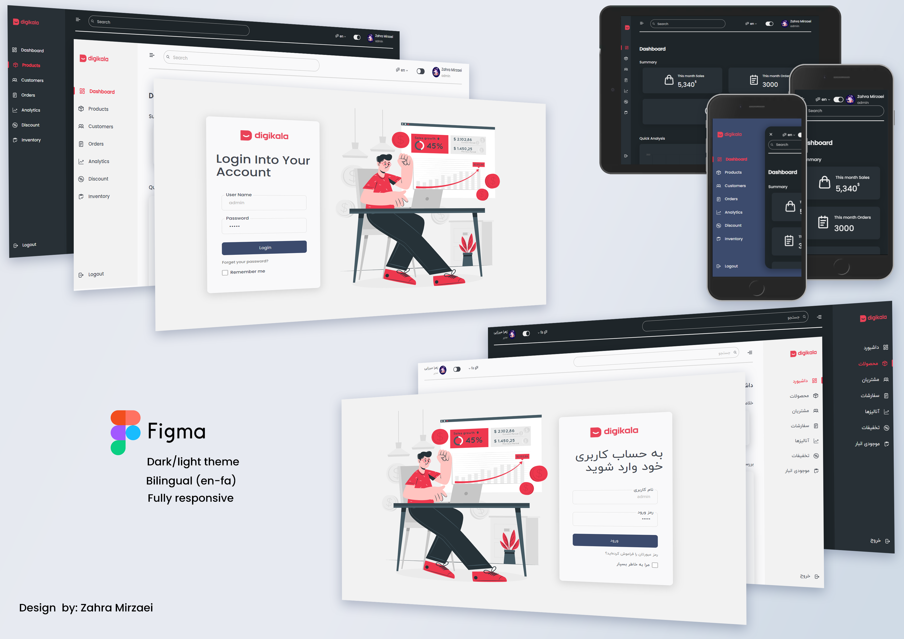

# React Admin Panel

React Admin Panel developed and build with **React (v17.0.2)**, **TypeScript (v4.4.2)** and **React Router v6**. For Styles, is used **SCSS**.
I am excited to share this dashboard with you and look forward to hearing your feedback [**my Linkedin post**](https://www.linkedin.com/posts/zahramirzaei_responsive-multilanguage-multitheme-activity-6920075757318725634-qRks?utm_source=linkedin_share&utm_medium=member_desktop_web)

# Demo

Visit: [Project React Admin Panel demo](https://admin-panel-portfolio.netlify.app/)

# Features

* Responsive layout
* Multi language
* Multi theme
* Charts(cahrtjs)
* React Hooks
* React Context
* React Router v6
* SCSS Modular
* iconify

# Pages

* Login
* Dashboard
* Products
* Edit Product
* Customers
* Edit Customers
* 404 Error(not found)

# Getting Started

**1. Clone from Github**

`git clone https://github.com/ZahraMirzaei/admin-panel.git`

**2. Run `npm install` or `yarn install`**

This will install both run-time project dependencies and developer tools listed in package.json file.

**3. Run `npm start` or `yarn start`**

Runs the app in the development mode.

Open http://localhost:3000 to view it in the browser. Whenever you modify any of the source files inside the /src folder, the module bundler (Webpack) will recompile   the app on the fly and refresh all the connected browsers.
      
**4. Run `npm build` or `yarn build`**

Builds the app for production to the build folder. It correctly bundles React in production mode and optimizes the build for the best performance.

The build is minified and the filenames include the hashes. Your app is ready to be deployed!

# Would you mind support me?

* Star GitHub repo
* Create pull requests, submit bugs, suggest new features or documentation updates.

College Teacher-Student Management System UML Diagrams
1. Use Case Diagram
Key Actors: Teacher, Student, System
Core Functionalities:

Teacher:

Login with institutional email

Add/Manage Subjects (Faculty > Section > Semester > Subject)

Take attendance & generate Excel reports

Add/view internal marks

Send notes/notices to specific batches/sections

Student:

View attendance records

Check internal marks

Access notes/notices

View teacher directory

Relationships:

Authentication is extended to all primary use cases

"Download Attendance" extends "View Attendance"

"Send Note" and "Send Notice" include subject validation

2. Class Diagram
Main Classes:

User (Abstract)

Attributes: userID, email, password

Methods: login(), logout()

Subclasses: Teacher, Student

Subject

Attributes: subjectCode, faculty, section, semester

Methods: validateSubject()

AttendanceRecord

Attributes: date, status (Present/Absent)

Methods: exportToExcel()

InternalMark

Attributes: assessmentType, score

Methods: calculateAverage()

Associations:

Teacher *-- Subject (1-to-many)

Subject -- AttendanceRecord (1-to-many)

Subject -- InternalMark (1-to-many)

Student "views" AttendanceRecord/InternalMark

3. Sequence Diagrams
Scenario 1: Teacher Takes Attendance
Teacher → UI: Select subject

UI → AttendanceController: Fetch student list

AttendanceController → Database: Retrieve section data

Database → AttendanceController: Return student data

AttendanceController → UI: Display attendance interface

Teacher → UI: Mark attendance

UI → Database: Save records

Scenario 2: Student Views Internal Marks
Student → UI: Request marks

UI → MarksController: Fetch data

MarksController → Database: Query marks

Database → MarksController: Return scores

MarksController → UI: Display marks

Scenario 3: Send College-Wide Notice
Teacher → UI: Compose notice

UI → NotificationController: Validate recipient (batch/section)

NotificationController → Database: Store notice

Database → PushService: Trigger alerts

PushService → Student Devices: Deliver notice

4. Activity Diagrams
Process 1: Teacher Adds Subject
Start → Select Faculty → Choose Section → Pick Semester → Validate Subject Code → Confirm → End

Parallel flows: Backend validation checks subject existence

Process 2: Student Views Attendance
Start → Login → Navigate to Dashboard → Select Subject → Choose Date Range → Display Calendar → End

Decision nodes: Handle "No records found" errors

Process 3: System Authentication Flow
Start → Enter Credentials → Verify Domain (@ioepc.edu.np) → Check Password → Grant Access

Alternate path: Invalid email → Display error

5. Component Diagram
Key Components:

Mobile App: Teacher/Student UI (Android/iOS modules)

Backend Services:

Authentication Controller

Attendance/Marks Management

Communication Gateway (Notes/Notices)

Database:

User Tables (Teachers/Students)

Subject Registry

Attendance/Marks Data

External Interfaces:

Excel Export Service

Email/SMS Gateways

Dependencies:

Mobile App → Backend (REST API)

Backend → Database (SQL/NOSQL)

Backend → External Services (OAuth for email)

Implementation Notes:

Use Case Extensions: Add password recovery for both actors

Class Diagram Constraints: Subject validation requires real-time backend checks

Sequence Diagram Optimization: Use caching for frequently accessed data (e.g., teacher directories)

Security: Encrypt Excel exports and notices using AES-256